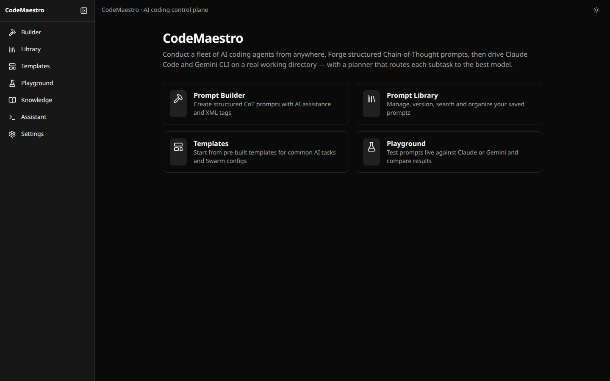
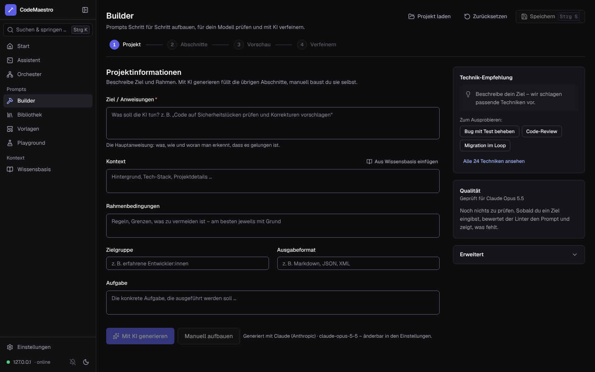
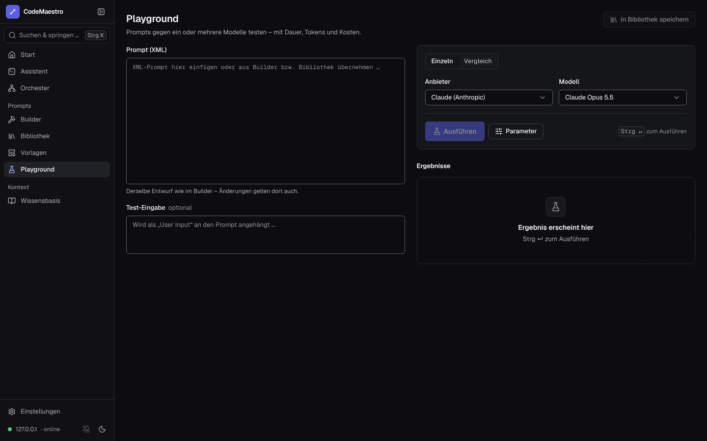
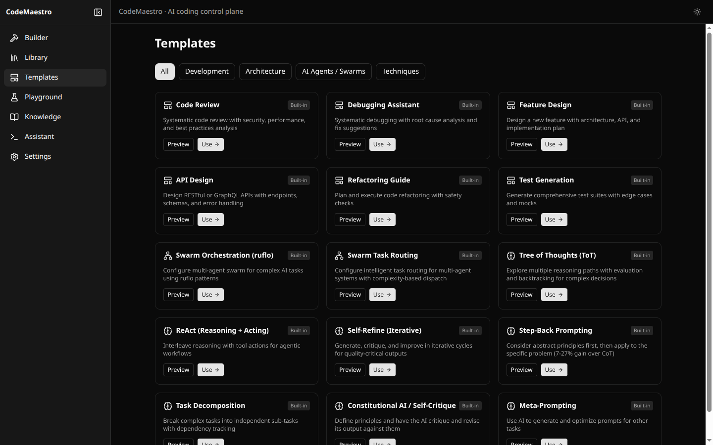
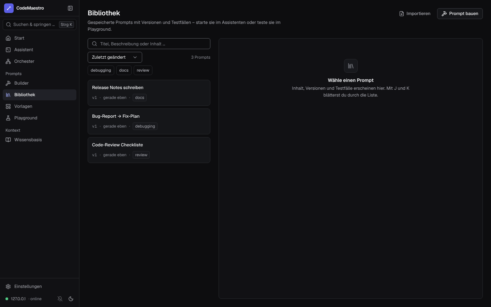
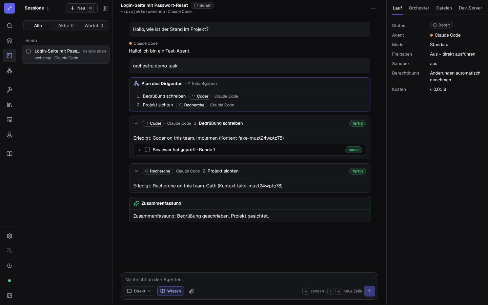
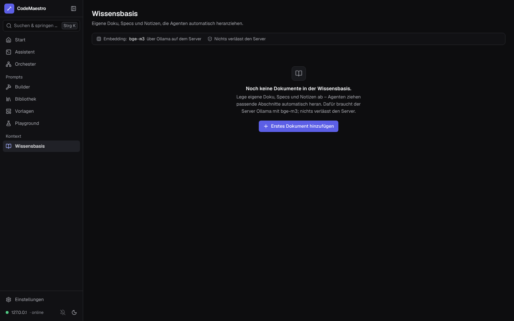
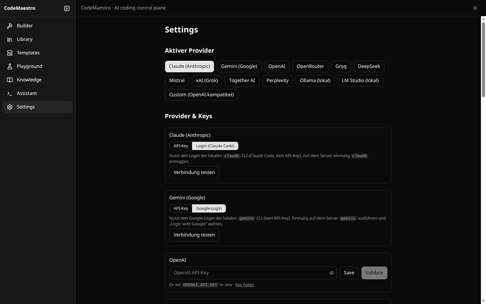

<div align="center">

# 🎛️ CodeMaestro

### Conduct a fleet of AI coding agents — from anywhere.

Forge structured prompts, then drive **Claude Code**, **Gemini CLI**, and **local models** on a real
working directory — from a self-hosted, phone-friendly PWA you control, with an approval gate and sandbox so you stay in command.

<br>

[](./LICENSE)
[](https://nextjs.org)
[](https://react.dev)
[](https://www.typescriptlang.org)
[](https://tailwindcss.com)
[](#-code-assistant)
[](#-security)
[](./.github/workflows/ci.yml)
[](./CONTRIBUTING.md)

<br>



</div>

> [!WARNING]
> **Run it private.** The Code Assistant, Orchestrator, and Telegram bridge execute shell commands on the host. Deploy only on `localhost` or a trusted private network — ideally your tailnet over HTTPS (see [docs/TAILSCALE_HTTPS.md](./docs/TAILSCALE_HTTPS.md)) — **never** expose it to the public internet. See [Security](#-security).

CodeMaestro turns AI coding from a single-terminal habit into an operable system: structure prompts with current Anthropic-recommended techniques, lint them for the model you target, test them across **Claude, Gemini, and local Ollama models** side by side, ground them in your own knowledge base, and — when you're ready to *act* — hand the task to an orchestra of agents whose roles you assign in an org chart, or let one agent **loop** on it until it's verifiably done. Work runs on the server, so you can close the window or lock your phone and pick up where it is — approvals and questions included. It runs entirely on infrastructure you control, installs as an HTTPS PWA on every device in your tailnet, notifies you by push, and can be driven from **Telegram** when you're away.

---

## Table of Contents

- [Why CodeMaestro](#why-codemaestro)
- [Features](#features)
- [Screenshots](#screenshots)
- [Providers & Auth](#-providers--auth--a-tool-for-everything)
- [Getting Started](#getting-started)
- [Configuration](#configuration)
- [Architecture](#architecture)
- [Status & Limitations](#status--limitations)
- [Security](#-security)
- [Roadmap](#roadmap--ideas)
- [License](#license)

---

## Why CodeMaestro

- **Command a fleet, not a terminal** — drive Claude Code, Gemini CLI and **local models (via pi)** from the browser or your phone, with live streaming, session resume and a dev-server launcher.
- **Close the window, keep working** — every turn, loop and orchestration runs on the server; the UI re-attaches when you come back and restores pending approvals and questions. Push notifications tell you when a decision is needed.
- **Orchestrate by roles** — an interactive **org chart** decides which model plays which role (conductor, architect, coder, reviewer, tester, …), with presets and an automatic review loop.
- **Loops that know when to stop** — repeat a task until the agent prints a completion promise, hits an iteration cap, or reports it's blocked.
- **You stay in command** — approval gate with diffs (or the shell command) before Edit/Write/Bash, deny-with-reason steering, sandbox, CSRF protection and an optional Tailscale identity allowlist.
- **Private-first** — self-hosted, SQLite storage, local embeddings, secrets encrypted at rest. Your prompts, keys and code stay on your machines.

---

## Features

### 🛠️ Prompt Builder
- Structured, XML-based prompt model (instructions, context, constraints, examples, task, audience, output format) with a live XML editor and two-way sync.
- **24 techniques**, grouped and sourced from Anthropic's current guidance — including agentic **Verification Loop**, **Explore → Plan → Code → Commit**, **Evaluator-Optimizer**, **Completion-Promise Loop (Ralph)**, **Definition of Done**, **Context Engineering**, **Long-Context Grounding**, **Subagent Orchestration**, **Interview → Spec** and **Scoped Autonomy** — each with an insertable snippet and a source link. Legacy techniques (e.g. "think step by step") are marked for models with adaptive thinking.
- **Model-aware**: recommendations, linter and the AI generator/refiner adapt to the target model (Claude 5 family, prefill/sampling support, reasoning-extraction risk).
- 23 built-in templates, including 8 for agentic coding with Claude Code (TDD loop, repro-first bug fix, refactor with verification, autonomous loop with a progress file, CLAUDE.md generator, …).
- Hand a prompt to the Code Assistant — as a single task or **as a loop**.

### ✅ Prompt Quality Linter
- Deterministic score (A–F, 0–100) on every keystroke — no API calls.
- Modern rules with sources: unsupported request params (prefill, sampling on Claude 5), reasoning-extraction risk, obsolete "think step by step", emphasis overload, negative-only instructions, rules without reasons, missing definition of done / verification step, long input after the query, example variety, length guidance, unbounded loops.

### 🧪 Playground & Evaluation
- Run a prompt against any provider/model, compare several side by side, with latency, token and cost readout.
- **Test cases** (contains / regex / equals) as a regression suite.

### 📚 Library, Versions & Export
- Tags, full version history with a diff viewer, export to Text, Markdown, JSON, YAML, Python and TypeScript.

### 🧠 Knowledge Base (RAG)
- Documents are chunked and embedded **locally via Ollama** (bge-m3); semantic search, "insert relevant context", and an opt-in RAG toggle for assistant and Telegram turns.

### 🤖 Code Assistant
- Drive **Claude Code**, **Gemini CLI**, **pi** (local models), OpenCode, Codex CLI and Aider on a real working directory, with token-by-token streaming of text and tool calls.
- **Resumable runs**: work runs server-side; the UI re-attaches after closing the window, reloads, standby or network changes and replays everything it missed (see [docs/ASSISTANT_RUNS.md](./docs/ASSISTANT_RUNS.md)).
- **Approval gate**: diff or shell command before Edit/Write/Bash, overwrite warnings, expiry countdown, approve / deny / deny-with-reason (the reason goes to the model). Pending decisions wait up to 30 minutes and survive a closed window.
- **Claude's questions are answerable**: a permission-prompt tool makes Claude Code's choice questions (AskUserQuestion) and plan approvals clickable cards even in headless runs — in turns, loops, Telegram and orchestrator subtasks — and turns commands outside the allowed tools into approval cards instead of silent denials.
- **Projekt fortsetzen**: every turn resumes the session's Claude Code conversation (`--resume`); a new session can pick up any earlier Claude Code conversation of the folder (newest preselected); orchestrations run on a fork of it and hand their summary back to the next turn.
- **Loop mode**: repeat a task until the agent prints `<promise>DONE</promise>`, hits the iteration cap, or reports `<promise>BLOCKED</promise>`; optional pause between iterations; fresh context per iteration with a progress file ("Ralph") or a continued conversation.
- Permission modes incl. `auto` and `dontAsk`, tool presets (incl. `Git` / `GitHub CLI` only), sandbox, file upload, dev-server launcher (optionally exposed over HTTPS via `tailscale serve`).

### 🧩 Orchestra — role-based multi-model orchestration
- An **interactive org chart** (`/orchestra`): the conductor plans and summarizes; roles — Architekt, Coder, Reviewer, Tester, Recherche, Doku, or your own — each get a model by drag & drop or tap, with instructions and a file-edit capability.
- Presets **Qualität / Ausgewogen / Lokal & günstig** are computed from the models actually available; live validation flags e.g. a file-editing role assigned to a text-only model.
- The planner assigns every subtask a role; an **evaluator-optimizer review loop** lets the reviewer check the coder's work and request fixes (up to three rounds). Auto, Hybrid (review the plan first) and Wizard modes; live view of which role is working.
- **Handoffs between agents**: every agent ends with a short handoff section, and the next one receives it for *all* earlier subtasks — the ones it depends on in detail, the others briefly — together with the files each subtask actually changed (measured with git) and the review outcome. The amount follows the receiving model's context window, so small local models are not flooded.
- **Team sync across sessions and agents**: whichever agent works on a project — Claude Code, pi, Gemini, a Telegram turn or an orchestration — leaves an entry in the project's shared work journal (what was asked, what was done, which files changed, measured with git). Every turn starts with the entries its agent has not seen yet, and with a warning when another agent is working in the same directory right now. Sessions are matched by their working directory.

### 🦙 Local models via pi
- With the [pi coding agent](https://pi.dev) installed, **every model on your Ollama server** is synced automatically (tools, thinking, vision and the real context window) and can **edit files** — in the assistant and as orchestra workers — with the same approval gate. CodeMaestro keeps its own pi config; `~/.pi` is untouched.

### 🐙 GitHub
- Connect your account in Settings (device flow or token). Assistant runs get working `git push` / `gh` credentials (token encrypted at rest, never sent to the browser), SSH remotes are rewritten to HTTPS, commits can use your GitHub identity, and sandboxed runs are allowed to reach GitHub.

### 📲 Telegram Bridge *(optional)*
- Drive the assistant from Telegram via long-polling (no public webhook): approvals, questions and plan approval as inline buttons, `/loop`, `/stop`, `/kb`, image upload. Turns run detached, so buttons and `/stop` work while a turn runs.

### 📱 PWA over HTTPS
- `npm run start:tailnet` + `npm run tailscale:up` serve CodeMaestro at `https://<machine>.<tailnet>.ts.net` with a real certificate, so it installs as an app on desktop, Android and iOS. Offline page, update toast, **Web Push** for approvals, questions and finished runs.

### 🔌 Providers & Auth — *a tool for everything*

- **Dedicated:** **Claude** (Anthropic SDK; current models incl. Opus 5.5 with effort, prompt caching and refusal fallback) and **Gemini** — via API key *or* their logged-in CLI.
- **Local:** **Ollama** (chat + pi agents) and **LM Studio**, plus a **custom OpenAI-compatible endpoint**.
- **Ollama Cloud** via API key.
- **Code-Assistant CLI agents:** Claude Code, Gemini CLI, pi, OpenCode, Codex CLI, Aider.

<details>
<summary><b>Full provider matrix</b> (8 cloud APIs + locals + CLI agents)</summary>

<br>

| Class | Providers | Auth |
|---|---|---|
| **Dedicated** | Claude (Anthropic SDK), Gemini (Google GenAI) | API key **or** CLI OAuth login |
| **OpenAI-compatible** | OpenAI, OpenRouter, Groq, DeepSeek, Mistral, xAI/Grok, Together, Perplexity | API key, with live `/models` discovery |
| **Local** | Ollama, LM Studio | auto-discovered, no key |
| **Custom** | any OpenAI-compatible base URL (Jan, llama.cpp, vLLM, LocalAI, Azure OpenAI…) | base URL (+ optional key) |
| **CLI agents** | Claude Code, Gemini CLI, pi, OpenCode, Codex CLI, Aider | each uses its own login/config; inert with an install hint until present |

New providers are catalog-driven — adding one is a few lines in `src/lib/ai/catalog.ts`.

</details>

---

## Screenshots

| Prompt Builder | Playground |
|---|---|
|  |  |

| Templates | Prompt Library |
|---|---|
|  |  |

| Code Assistant | Knowledge Base |
|---|---|
|  |  |

| Settings & Providers | Home |
|---|---|
|  |  |

<sub>Screenshots are from a running self-hosted instance (dark theme).</sub>

---

## Getting Started

### Prerequisites
- Node.js **≥ 20.9** (Node 22 recommended; pi needs ≥ 22.19)
- For local models: [Ollama](https://ollama.com) (default `http://localhost:11434`), optionally the [pi coding agent](https://pi.dev): `npm install -g --ignore-scripts @earendil-works/pi-coding-agent`
- For the Code Assistant: [Claude Code](https://claude.com/claude-code) and/or [Gemini CLI](https://github.com/google-gemini/gemini-cli) installed and authenticated
- For HTTPS/PWA on your devices: [Tailscale](https://tailscale.com) with MagicDNS and HTTPS certificates enabled
- For the Telegram bridge *(optional)*: a bot token from [@BotFather](https://t.me/BotFather)

### Install & run
```bash
git clone https://github.com/Muchel187/CodeMaestro.git
cd CodeMaestro
npm install

cp .env.example .env          # DATABASE_URL="file:./dev.db" = <project root>/dev.db
npx prisma migrate deploy     # create the SQLite schema
npx prisma generate

npm run dev                   # http://localhost:3000
# or, for production:
npm run build && npm start
```

Updating a running installation (stop the server first — a build while it runs
overwrites the `.next` output it serves from):
```bash
git pull && npm ci
npx prisma migrate deploy     # applies new migrations (e.g. indexes); data is kept
npx prisma generate
npm run build                 # then start the server again
```
The database runs in SQLite's write-ahead mode, so `dev.db-wal` and `dev.db-shm`
sit next to `dev.db`. Back it up with `sqlite3 dev.db ".backup copy.db"` (or copy
all three files), never `dev.db` alone.

### HTTPS on your tailnet (installable PWA)
```bash
npm run build
npm run start:tailnet         # binds 127.0.0.1 — only tailscale serve + local processes reach it
npm run tailscale:up          # tailscale serve --bg --https=443 http://127.0.0.1:3000
# → https://<machine>.<tailnet>.ts.net — open it on any device and install the app
```
Step-by-step guide incl. systemd units, iOS/Android install and push notifications: [docs/TAILSCALE_HTTPS.md](./docs/TAILSCALE_HTTPS.md).

API keys can be entered in **Settings** (stored client-side, encrypted with Web Crypto over HTTPS) or set in `.env` — no key is required for Ollama or for Claude/Gemini when using CLI logins.

---

## Configuration

All environment variables are optional; sensible defaults apply. Put them in `.env` (Prisma and the seed read `.env`, not `.env.local`). See [`.env.example`](./.env.example) for comments.

| Variable | Default | Purpose |
|---|---|---|
| `DATABASE_URL` | `file:./dev.db` | SQLite database (relative to the project root) |
| `ANTHROPIC_API_KEY` / `GOOGLE_API_KEY` / `GEMINI_API_KEY` | — | Server-side fallback keys |
| `OLLAMA_BASE_URL` | `http://localhost:11434` | Ollama endpoint (chat, embeddings, pi model sync) |
| `OLLAMA_EMBED_MODEL` | `bge-m3:latest` | Embedding model for the knowledge base |
| `OLLAMA_API_KEY` | — | Ollama Cloud |
| `ASSISTANT_ALLOWED_DIRS` | parent of the app dir | Colon-separated roots the assistant may work in (restart after changes) |
| `ASSISTANT_APPROVAL_TIMEOUT_SEC` | `1800` | How long approvals/questions wait before auto-deny |
| `CODEMAESTRO_TAILSCALE_USERS` | — | Identity allowlist for `/api` (Tailscale logins, `*` = any tailnet user) |
| `CODEMAESTRO_ALLOWED_ORIGINS` | — | Extra origins allowed to send state-changing API requests |
| `CODEMAESTRO_PUSH_SUBJECT` | project URL | VAPID contact for Web Push |
| `CODEMAESTRO_DEV_TAILSCALE_SERVE` | — | `1` = expose launched dev servers via `tailscale serve` (HTTPS links) |
| `CODEMAESTRO_DEV_ORIGINS` | — | Extra hosts `next dev` accepts HMR from |
| `CODEMAESTRO_INTERNAL_URL` | `http://127.0.0.1:$PORT` | URL the approval hook calls back |
| `CODEMAESTRO_SECRET` | auto key file | Key for encrypting stored secrets (else `.codemaestro/secret.key` — back it up) |
| `GITHUB_OAUTH_CLIENT_ID` | — | OAuth App client ID for "Mit GitHub verbinden" (device flow) |
| `PI_BIN` / `PI_OLLAMA_CONTEXT_LENGTH` / `CODEMAESTRO_PI_AGENT_DIR` | `pi` / `32768` / `.codemaestro/pi-agent` | pi binary, assumed Ollama context, pi config dir |

> The **Telegram bridge** and the **GitHub connection** are configured in **Settings**; tokens are stored server-side only.

---

## Architecture

```
Next.js App (App Router, React 19, Tailwind v4)
├─ UI: Start · Assistant · Orchester · Builder · Bibliothek · Vorlagen · Playground · Wissensbasis · Einstellungen
│      (design system in docs/DESIGN.md; ⌘K palette, mobile tab bar, activity center)
├─ src/proxy.ts                  CSRF guard + optional Tailscale identity allowlist for /api
├─ API routes
│  ├─ /api/ai/*                  chat · models · validate
│  ├─ /api/assistant/*           sessions · message/loop/orchestrate (202 + runId) · events (SSE) · approvals · pi · activity
│  ├─ /api/orchestra             org chart config + presets
│  ├─ /api/github · /api/push    account connection · Web Push
│  └─ /api/prompts, /templates, /test-results, /knowledge
├─ lib
│  ├─ assistant/                 run hub (resumable runs) · runner (Claude/Gemini/pi/…) · approvals · loop · orchestrator + orchestra · telegram
│  ├─ prompt-engine/             techniques · model profiles · linter · XML build/parse · generator/refiner prompts
│  ├─ ai/                        provider factory, model discovery, pricing, embeddings
│  └─ knowledge/                 shared RAG retrieval
└─ Prisma + SQLite               prompts, versions, tests, knowledge, sessions, settings
```

Assistant work runs detached from HTTP requests in a process-wide **run hub**: browsers attach over SSE (`EventSource`, resumable via `Last-Event-ID`), the transcript is persisted progressively, and approvals are published into the run so any client — or Telegram — can answer them. Details: [docs/ASSISTANT_RUNS.md](./docs/ASSISTANT_RUNS.md).

---

## Status & Limitations

CodeMaestro is under active development. Things to know:

- **Orchestrator subtasks run sequentially** (dependency order, shared working directory). Planning is prompt-based, not learned routing — review plans in Hybrid mode for non-trivial work.
- **The approval gate is enforced for Claude Code and pi.** Gemini CLI, OpenCode, Codex and Aider run their tools directly; sessions for them can't enable the gate (and the orchestrator runs Gemini read-only in gated sessions). The sandbox is Claude-Code-only.
- **A server restart ends running work** (CLI processes don't survive it); everything streamed so far is in the transcript, and the session can continue.
- **Tests**: a Vitest suite covers the run hub, runner, approvals, loop, orchestrator/orchestra, pi, prompt engine and UI logic; CI runs lint, typecheck, tests and build. End-to-end flows with real CLIs are still validated manually.
- **Security posture is "trusted network only"** — see below.

---

## 🔒 Security

CodeMaestro is designed for a **trusted, private environment** (localhost or your tailnet), not the public internet.

- **The assistant, orchestrator and Telegram bridge execute code and shell commands** on the host — anyone who can reach the app can drive them. Working directories are confined to `ASSISTANT_ALLOWED_DIRS` (realpath-checked, symlink-safe uploads); tools default to read-only; the approval gate fails closed (a missing or crashing hook denies).
- **Run it behind `tailscale serve`** bound to `127.0.0.1` (`npm run start:tailnet`); optionally restrict `/api` to specific tailnet users with `CODEMAESTRO_TAILSCALE_USERS`.
- **CSRF protection**: state-changing API requests from other origins are rejected (`src/proxy.ts`), so a web page you visit can't drive your instance.
- **Secrets**: GitHub tokens are AES-256-GCM encrypted at rest and never returned to the browser; the Telegram token stays server-side; API keys entered in Settings live in the browser, encrypted with Web Crypto in a secure (HTTPS) context — over plain HTTP they are only obfuscated. The approval hook authenticates with a per-process token.
- **Telegram** is allowlisted by chat ID (empty = nobody). Treat it like remote shell access.
- No telemetry.

---

## Roadmap / Ideas

- Parallel subtask execution in the orchestrator (independent subtasks, worktrees)
- Structured outputs for the prompt generator; a target-model selector in the builder
- Evals: build-eval / hill-climb workflows for saved prompts
- Shareable prompt packs / team library

---

## Contributing

Issues and PRs are welcome — see [`CONTRIBUTING.md`](./CONTRIBUTING.md) and [`SECURITY.md`](./SECURITY.md). CI runs `npm run lint`, `npm run typecheck`, `npm test` and `npm run build` on every pull request.

---

## License

Released under the **GNU Affero General Public License v3.0 (AGPL-3.0)**.
© 2026 Jurak Bahrambäk. Free to use, modify, and self-host; network/SaaS use must release source changes.

See [`LICENSE`](./LICENSE) for the full text.
